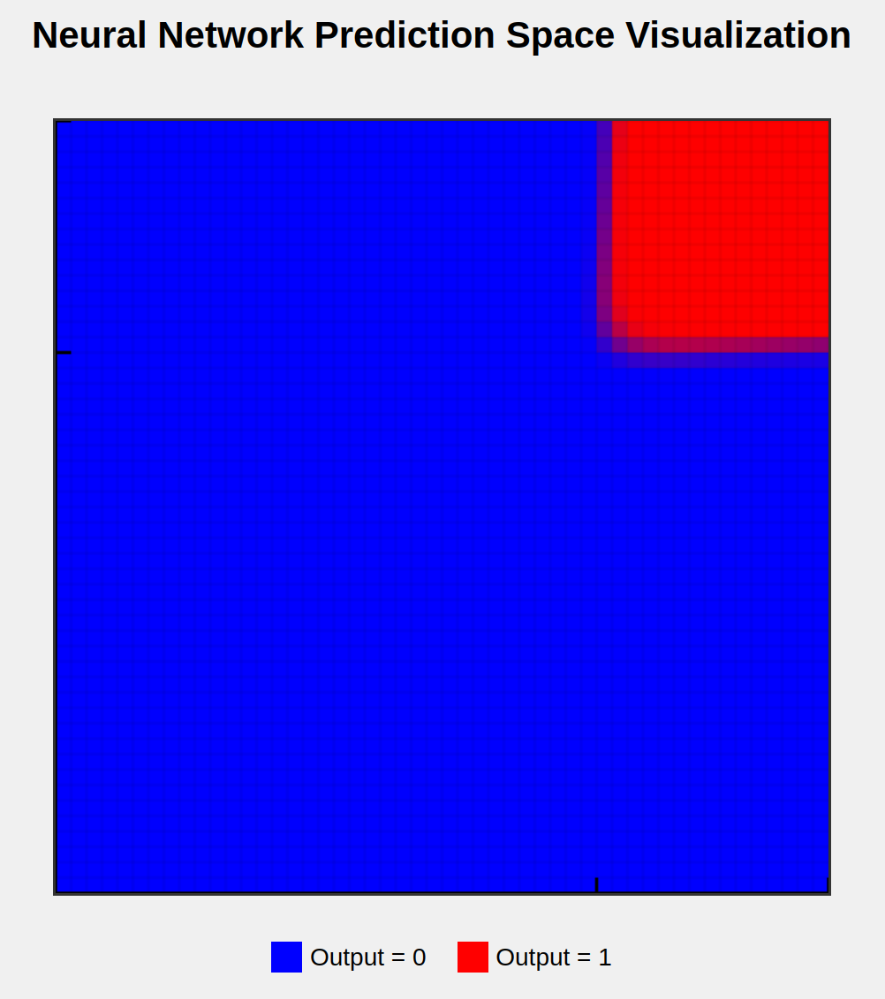
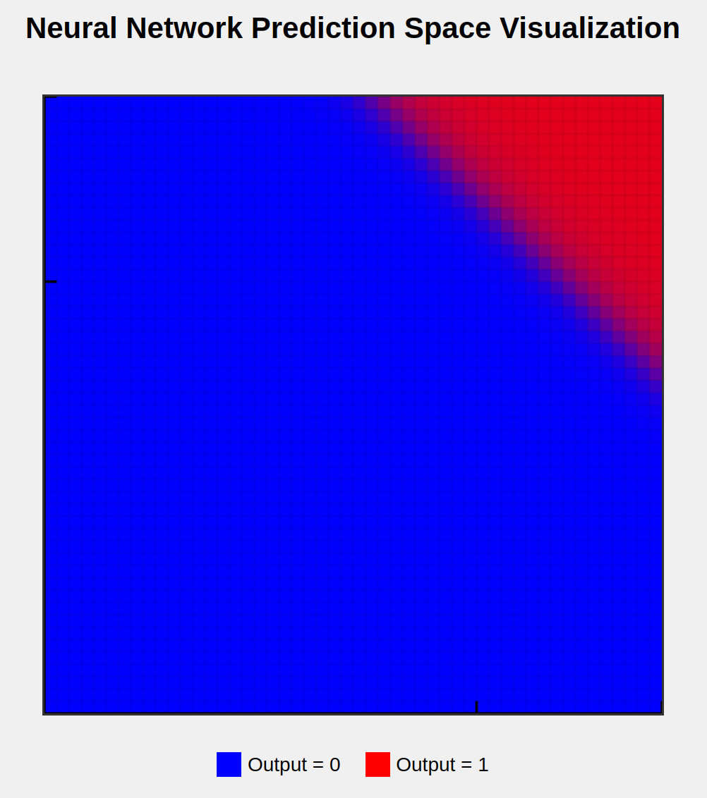
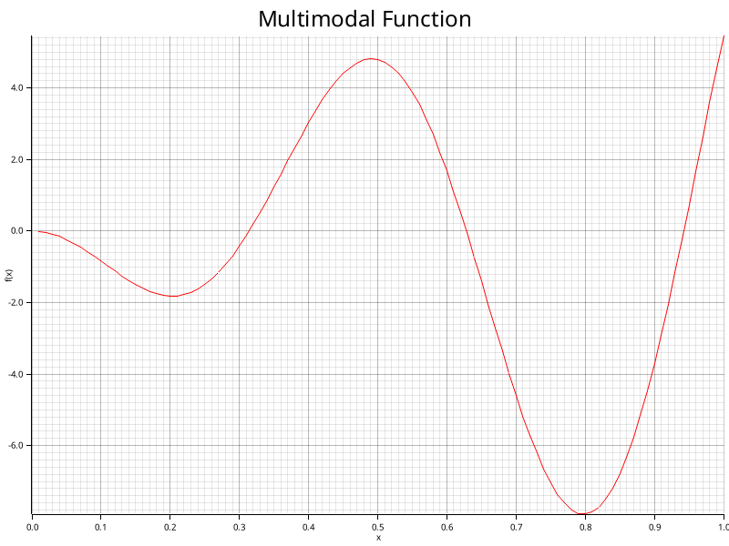

# 1 step

Cloned the rusty-machine repo https://github.com/AtheMathmo/rusty-machine

I chose this repo from this collection https://www.arewelearningyet.com/neural-networks/ because i looked for a minimal framework that implements the utility of feedforward neural network training without deep learning approaches. This repo seemed to be the most tidied. Unfortunately the Levenberg marquardt optimizer is not implemented, but maybe i can add it. As i did not want to use wrappers, this is the best implementation for my usecase.

The first test showed that the framework is able to train on an AND gate with a BCECriterion and sigmoid activation functio. Here are some pics:

And with an unsufficient network structure:

You can see the threshold of the AND gate at 0.7

This was all done in the example/test.rs which was adjusted from the nnet-and_gate.rs

# Step 2

Now i want to use a 1D benchmark function in the [-1,1] range to test the capability to approximate functions with a MSE (mean square error) error metric. Is is commonly used for fitting. For the AND gate a BCE (binary cross entropy) was used that is an error function for classification.

## Benchmark function implementation

Create a benchmark function -x*sin(x)

To implement benchmark functions, I added a Multimodal1D trait to src/benchmark_functions/analytic.rs which implments the previously said function with a scaling for f64 and Vec\<f64\>.

## Plotting

It is crucial for debugging to see the plot of the benchmark function and network approximation.

So first i need to implement a method to plot the benchmark function. I use the crate plotters  https://docs.rs/plotters/latest/plotters/ because of the versitily and option to do a WASM for fast interactive plotting.

It work and the implementation is far more efficient than the previous html approach.

To test it I worked in  playground/plot_testing.rs

To be able to execute "cargo run --bin plot_testing", I added

    [[bin]]
    name = "plot_testing"
    path = "playground/plot_testing.rs"

 to Cargo.toml

 ## Training

 So now that I known that i can create a good dataset for performance analysis I need to implement training and verification.

